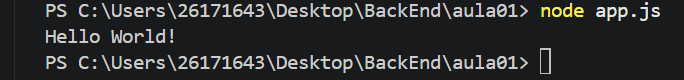

# Meu primeiro projeto JavaScript 

## Alunos🤣

# Nome: Camily
# Turma: DS1A
# Professor: Vitor 
---

## Sobre

Este projeto foi desenvolvido durante a primeira aula de JavaScript.

O objetivo foi aprender:
- utilizar o VS Code;
- executar o JavaScript com Node.js
- utilizar o Terminal 
- criar documento utilizando Markdown

---
## 🗂️ Estrutura

```
MeuPrimeiroProjetoJS
|
|-app.js
|-informacoes.js
|-operadores.js
|-variavel.js
|-readme.md
|-imagem/

```

## Como executar

```bash
    node app.js
```
## Código

```javascript
    console.log("Ola, mundo");
```
## Resultado



## Tecnologia
- Node.js
- Visual Studio Code
- Markdown

## O que aprendi
- Criar arquivo JavaScript.
- Executar programas.
- Utilizar terminal
- Criar README.
- Instalar extensões
- Utilizar Markdown
- GIT
- Variável
- Operadores